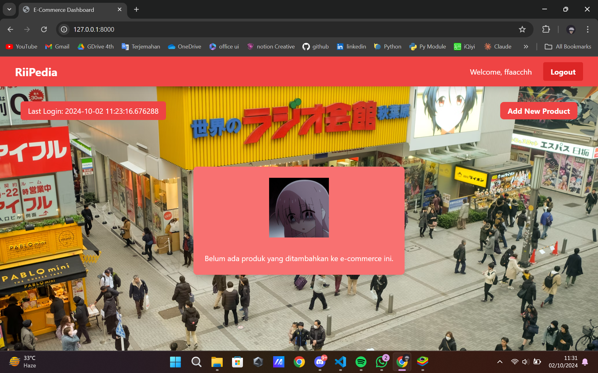

# RiiPedia
## First PBP Individual Project by
### Hadyan Fachri
### 2306245030
### PBP A

## PWS
[RiiPedia](http://hadyan-fachri-riipedia.pbp.cs.ui.ac.id/)

## Wiki for README.md Archieve
- [Tugas Individu 2](https://github.com/fachhhh/RiiPedia/wiki/Archieve-Tugas-Individu-2-PBP)
- [Tugas Individu 3](https://github.com/fachhhh/RiiPedia/wiki/Archieve-Tugas-Individu-3-PBP)
- [Tugas Individu 4](https://github.com/fachhhh/RiiPedia/wiki/Archieve-Tugas-Individu-4-PBP)

## Checkpoint Tugas Individu 5
✔ Implementasikan fungsi untuk menghapus dan mengedit product.\
✔ Kustomisasi desain pada template HTML yang telah dibuat pada tugas-tugas sebelumnya menggunakan CSS atau CSS framework (seperti Bootstrap, Tailwind, Bulma) dengan ketentuan sebagai berikut:\
    ✔ Kustomisasi halaman login, register, dan tambah product semenarik mungkin.\
    ✔ Kustomisasi halaman daftar product menjadi lebih menarik dan responsive. Kemudian, perhatikan kondisi berikut:\
        ✔ Jika pada aplikasi belum ada product yang tersimpan, halaman daftar product akan menampilkan gambar dan pesan bahwa belum ada product yang terdaftar.\
        ✔ Jika sudah ada product yang tersimpan, halaman daftar product akan menampilkan detail setiap product dengan menggunakan card (tidak boleh sama persis dengan desain pada Tutorial!).\
    ✔ Untuk setiap card product, buatlah dua buah button untuk mengedit dan menghapus product pada card tersebut!\
    ✔ Buatlah navigation bar (navbar) untuk fitur-fitur pada aplikasi yang responsive terhadap perbedaan ukuran device, khususnya mobile dan desktop.

### 1. Jika terdapat beberapa CSS selector untuk suatu elemen HTML, jelaskan urutan prioritas pengambilan CSS selector tersebut!
Jawab:\
CSS mempunyai urutan prioritas dalam menentukan gaya mana yang ingin diterapkan pada elemen ketika ada beberapa aturan CSS. Urutan yang dari yang paling berbobot rendah ke bobot yang paling tinggi.\
\
1. **!important Declaration**:\
Ini adalah aturan yang paling diutamakan dan mengalahkan semua spesifisitasnya.\
\
2. **Inline Style**:\
Aturan ini ditetapkan langsung pada elemen HTML dengan menggunakan atribut `<style>` dan memiliki spesifisitas yang lebih tinggi daripada semua selector lainnya meskipun **!important** masih menjadi tahta tertinggi CSS selector.\
\
3. **ID Selector**:\
Aturan selector ini mencakup elemen berdasarkan ID maka dari itu ID selector memiliki spesifitas yang lebih tinggi dari class dan atribute selector. Contohnya `#id-name { color: purple; }`\
\
4. **Pseudo-class Selector**:\
Pada selector ini mencakup keadaan khusus dari elemen. Misalnya, `:hover` atau `:first-child` memiliki spesifisitas yang setara dengan class dan attribute selectors.\
\
5. **Attribute Selector**:\ Selector ini mencakup elemen berdasarkan atributnya. Misalnya, `[type="text"] { color: orange; }` memiliki spesifisitas yang setara dengan class selector.\
\
6. **Class Selector**:\
Selector ini mencakup elemen berdasarkan kelas. Misalnya, `.class-name { color: green; }` memiliki spesifisitas yang lebih tinggi dibandingkan type selector.\
\
7. **Type Selector**:\
Selector ini mencakup elemen HTML berdasarkan jenisnya. Misalnya, `p { color: red; } `memiliki spesifisitas yang lebih tinggi dibandingkan universal selector.\
\
8. **Universal Selector**:\ Selector ini memiliki spesifisitas terendah. Misalnya, `* { color: blue; }` akan diterapkan ke semua elemen, tetapi tidak akan mengalahkan aturan yang lebih spesifik.

### 2. Mengapa responsive design menjadi konsep yang penting dalam pengembangan aplikasi web? Berikan contoh aplikasi yang sudah dan belum menerapkan responsive design!
Jawab:\
Karena akan menimbulkan beberapa efek yang pertama **User Experience**. Dengan website yang responsif, user dapat merasakan penggunaan yang baik. Sebuah keharusan programmer membuat website tersebut responsif ke segala platform mulai dari desktop, handphone maupun tablet.\
\
Kedua adalah **Aksesibilitas**. Dalam mengakses web dari berbagai perangkat, website dan design yang responsif dapat memudahkan user untuk mengakses informasi yang sama.\
\
Ketiga adalah **Search Engine Optimization** yang bisa disingkat SEO. Contoh mudah dari SEO adalah Google. Google adalah Search Engine yang digunakan oleh semua orang karena kemudahannya dalam mengases berbagai konten dan informasi.\
\
Keempat adalah **Biaya yang hemat**. Dengan menggunakan website yang responsif, dapat menghemat biasa karena tidak perlu membuat situs secara terpisah.

### 3. Jelaskan perbedaan antara margin, border, dan padding, serta cara untuk mengimplementasikan ketiga hal tersebut!
Jawab:\
**Margin** adalah ruang kosong di luar batas elemen. Ini digunakan untuk memberikan jarak antara elemen dengan elemen lain di sekitarnya.\
\
Cara mengimplementasikannya dengan cara ditetapkan secara individual untuk setiap sisi elemen atas, kanan, bawah, kiri atau secara keseluruhan. Kemudian nilai margin bisa dalam satuan pixel, persen, em, dll.\
```
.box {
    margin: 20px; /* Jarak 20px di semua sisi */
}

.box-custom {
    margin-top: 10px;    /* Jarak 10px di atas */
    margin-right: 15px;  /* Jarak 15px di kanan */
    margin-bottom: 20px; /* Jarak 20px di bawah */
    margin-left: 5px;    /* Jarak 5px di kiri */
}
```

**Border** adalah garis yang mengelilingi elemen. Ini dapat digunakan untuk mempertegas batas elemen dan menambah visualisasi.\
\
Cara mengimplementasikannya dapat dengan cara diatus dengan lebar, gaya, dan warna. Kemudian dapat mengatur border secara keseluruhan atau individual untuk setiap sisi.\
```
.box {
    border: 2px solid black; /* Border 2px, solid, berwarna hitam */
}

.box-custom {
    border-top: 1px dashed red;   /* Border atas 1px, dashed, merah */
    border-right: 2px double blue; /* Border kanan 2px, double, biru */
    border-bottom: 3px solid green; /* Border bawah 3px, solid, hijau */
    border-left: 4px dotted yellow; /* Border kiri 4px, dotted, kuning */
}
```

**Padding** adalah ruang di dalam elemen, antara konten elemen dan batas (border) elemen tersebut. Ini digunakan untuk memberikan jarak antara konten dan border.\
\
Cara mengimplementasikannya dengan cara ditetapkan secara individual untuk setiap sisi elemen atau secara keseluruhan. Kemudian nilai padding mirip seperti margin, pixel, persen, em, dll.
```
.box {
    padding: 15px; /* Jarak 15px di dalam semua sisi */
}

.box-custom {
    padding-top: 5px;    /* Jarak 5px di atas konten */
    padding-right: 10px; /* Jarak 10px di kanan konten */
    padding-bottom: 15px; /* Jarak 15px di bawah konten */
    padding-left: 20px;   /* Jarak 20px di kiri konten */
}
```

### 4. Jelaskan konsep flex box dan grid layout beserta kegunaannya!
Jawab:\
**Flexbox** adalah model tata letak yang  dirancang untuk mengatur elemen dalam satu dimensi, baik secara horizontal maupun vertikal. Ini memungkinkan untuk elemen di dalam wadah beradaptasi dengan ukuran dan posisi berdasarkan ruang yang tersedia. Flexbox mempunyai karakteristik seperti dapat disusun dalam baris atau kolom, ukuran yanng responsif dan alignment yang fleksibel. Flexbox mempunyai kegunaan untuk mengatur navbar, mengatur form, elemen UI dan membuat gambar yang responsif.\
\
**Grid Layout** adalah model tata letak yang memungkinkan pengembang untuk mengatur elemen dalam baris dan kolom. Grid Layout dapat membuat struktur yang kompleks dengan mudah dibanding tata letak biasa. Karakteristik dari Grid Layout adalah baris dan kolom, area grid dan ukuran yang berbeda beda. Kegunaan Grid Layout adalah untuk membuat layout yang kompleks, menyusun konten dengan pengaturan dua dimensi, dan mempermudah penataan UI.

### 5. Jelaskan bagaimana cara kamu mengimplementasikan checklist di atas secara step-by-step (bukan hanya sekadar mengikuti tutorial)!
Jawab:\
Pada tugas 5 kali ini, kita diminta untuk membuat fungsi edit dan menghapus produk. Maka dari itu saya membuat function di `views.py`
```
def edit_product(request, id):
    product = Ecommerce.objects.get(pk = id)
    form = EcommerceEntryForm(request.POST or None, instance=product)
    
    if form.is_valid() and request.method == "POST":
        form.save()
        return HttpResponseRedirect(reverse('main:show_main'))
    
    context = {'form':form}
    return render(request, "edit_product.html", context)
```
Lalu set url di `urls.py` pada main. Untuk Edit Product, kita juga perlu membuat html khusus untuk mengedit produk dengan UI dan fungsi kurang lebih sama dengan `create_product_enty.html`. Untuk function delete product pada `views.py` saya membuatnya seperti ini

def delete_product(request, id):
    product = Ecommerce.objects.get(pk = id)
    product.delete()
    return HttpResponseRedirect(reverse('main:show_main'))

Kemudian set url di `urls.py` pada main. Delete product hanya perlu membuat tombol delete sehingga tidak diperlukan untuk membuat html khusus seperti edit product. Kesamaan dari fungsi tersebut adalah kedua fungsi tersebut harus mengambil primary key dari masing - masing produk yang diambil dari database.\
\
Selanjutnya saya sudah membuat halaman produk secara responsif dan di design dengan sedikit perubahan pada tampilannya.\
Jika tidak ada produk yang ditambahkan akan menampilkan gambar dan tulisan "Belum ada produk yang ditambahkan ke e-commerce ini."\

Jika ada produk yang ditambahkan, tampilannya akan seperti pada gambar berikut.\

\
Disetiap produk sudah tertera tombol edit yang langsung mengarahkan user ke edit form dan tombol delete untuk menghapus produk secara instan.\
\
Saya juga sudah membuat navbar yang responsif untuk kedua platform, mobile dan desktop yang bisa dilihat identasinya di navbar.html\


## Terima Kasih